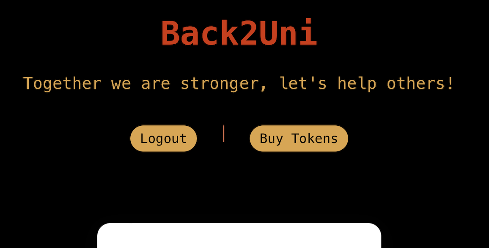

### Back2Uni Project

Back2Uni is a DeFi platform created for helping universities interact with their communities. The database is the smart contract, storing all the info fully on-chain. The smart contract was deployed in Polygon Mumbai.

Anyone with a something@any-university.edu email could use the platform to interact with his/her Uni. Thanks to the Magic SDk we are able to validate the identity of the university users(Funders and Admin user) without any cumbersome steps or long verification process, giving them instanst access to the university pool.

If a user is created and the university domain doesn't exist already in the smart contract then a new university will be registered using the "any-university.edu" web domain as the unique identifier.

There are two types of users:
1. Admins: There is just one admin user per university. In order to create this type of user the person needs to send 0.2 tokens to the smart contract, to show skin in the game. Admins from the University will need to create a b2u.admin@any-university.edu in order to validate they have control over the university web domain and could represent the university in the Web3 space.

2. Funders: The rest of the community from the university could use their emails to signUp and enjoy the platform. Funders are able to create proposals, vote proposals, and execute proposals(just allowed for the user who created the proposal). A proposal would pass if it has more than half of the amount of users (associated to the university pool) as votes

### Functionalities

1. Easy onboarding and wallet management, thanks to Magic SDK.

2. Easy LogOut/Login and an option to buy tokens using the Magic UI. 

3. It also includes a "For Testing" section to allow testers to change the email after Magic's email validation and before sending the user info to the smart contract. The idea here would be to enter an university emails such as student1@superuniversity.edu, b2u.admin@superuniversity.edu, etc, for creating a community and being able to test all the functionalities.

4. Create an user(admin or funder), and get the user's info.

5. Complete info of the pool linked to the University.

6. List of proposals, with name, description, # of votes, buttons for voting and executing it, and more.

7. Proposals creation. The platform make the users send 0.02 tokens as a security measure before allowing them create the first proposal.

8. Withdrawal of the funds sent by the funders and admins.

### Future Functionalities

For the second phase of Back2Uni, the platform will include:

1. Gasless transactions using Biconomy SDK.

2. Enable funding the proposals with the tokens already staked, and letting the university withdraw the funds.

3. Onboarding of university providers(they would need at least an official @company.com email and a working web page), which would be any company that offers products or services to universities, that could be added to the university pool by the Admin to be the providers (or they could even add themself to the pool)making the proposals a reality and receiving the funds associated to them. The providers would be able to bid for the proposals and The Funders would be also able to vote for the best bid.

### Video Demo

Link to the video Demo:
https://drive.google.com/drive/folders/19aKyM-5by0o6GnBYDt47pbo8Q5DUhS8T?usp=sharing

### Tecnologies from the sponsors

In this project I used Magic for the onboarding and the smart contract wallets they create with their SDK. I also used a boilerplate created from Magic Labs for Universal Wallets.

### How to Run it
Clone the repo and:
1. npm install
2. npm start

### Directories and keys

The smart contract is located inside /contracts.
The source files for the next.js app are located in /src.
The Magic key I created for using the SDK is inside .env, feel free to use it or replace for yours.

### Troubleshooting

If when running you are getting errors related to permissions and the cache, then you need to run:
sudo npm start
